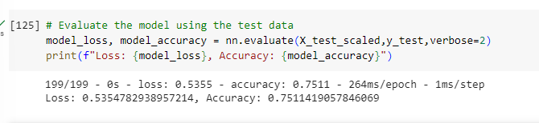

# AlphabetSoup Charity Optimization Report

### Overview

    This analysis is being undetaken for the Alphabet Soup Foundation. Every Year, Alphabet Soup gets applications from business entities looking for funding for their company and they want to improve their chances of selecting sucessful business ventures to fund. In order to help them improve, I will be compiling a neural network that will predict the likelihood that a business will succeed if it receives funding.

    While analyzing the data I saw that 25,394 of the applicants were asking for $5,000.00 in funding. I decided it would be best to focus the analysis in these companies as they make up the bulk of the foundations applicants. Thus, The model I am building will predict the likelihood that a company asking for $5,000.00 in funding will succeed.

# Results

## Data Preprocessing

    The data consists of 34,000 records that include metatdata on each comapny such as the appication type, affiliation, cliassification, use_case, organization, status, income amount, special considerations, the ask amount, and whether it was successful.

    There were a few transformations  done to the data. First, the EIN and name columns were dropped as they would not be useful for the analysis. Second, some columns with multiple values were binned. First, the top 5 most common application types were kept while all of the other application types were grouped into 'other'. Second,  only the top 5 classifications were kept and the rest were converted to 'other'. Thirdly, since  25,394 of the 34,000 applicants were asking for $5,000, I decided to drop the other amounts and only focus on these companies in the analysis. Lastly, there were 5 record where the application was not active so these were dropped as well.

### Model Compiling, Training , and Evaluation

    The final model that produced the best results had 38 input dimensions and two hidden layers. The hidden layers had 80 and 40 dimensions respecfully and were activated by the tanh function. The reason I used the high amount of neurons is that it accounts for the numerous amount of ways that a business venture could succeed or fail.  It is for this reason that I believe this model had a higher accuracy than the model I ran that used less neurons.

The reason I stuck with two hidden layers is due to overfitting and underfitting. When I tried oen hidden layer, the training accuracy and test accuracy were both lower. When I tried three hidden layers, the training accuracy was around 74% but the test accuracy was lower around 71% which suggests some overfitting. Thus, I went with two hidden layers which has a training accuracy of 75.13 % and a testing accuracy of 75.11%.

I was able to reach the target accuracy but I had to make a bunch of tweaks to my model. FIrst, I had to narrow my scope to just applications asking for 5,000.00. When I looked at the value counts for the "amount asked" dimension, I found that all other amounts were not requested more than a few times each. I think it was hard for the model to make accurate predictions since the other ask amounts were so low. It is hard to model  a company asking for let's say $500,000.00  since so few applicants requested it. Plus, it could prove detrimental to the foundation if I did keep those obscure amounts. The higher the amount the higher the risk. If my model does not have enough instances to train on, than it will be inaccurate and not a model that should be used to predict the outcome of such an application.

Second,  I had to decrease the amount of application types and classifications. What I mean by that is that I include more application types and classifications into the "other" group. I did this for the same reason as the ask amount column. Most of the applications and classifications were of the same type. It's hard to model application types that have very few occurences.

Finally, 

    I started with one hidden layer and move up to three before settling on two. Furthermore, I experimented with changing the neurons through trial and error before I was able to come up with a model that hit the target accuracy. Below is picture of the test results

### Summary and Recommendations

    In conclusion, my model was able to successfully predict the outcome of an application asking for $5,000.00 75% of the time. I would say this is quite good considering there are an infinite amount of things, forseen and unforseen, that could pop up and impact a business venture. It would be impossible for any model to be able to predict these outcomes with 100% accuracy. Since the bulk of the applications are for $5,000, this model will serve the foundation well with choosing ventures to fund and which ventures reject.

I would recommend trying to gather more data on other types of applications. If there is more application data on organizations asking for different amounts than we can use that to build a model that encompasses all ask amounts instead of just $5,000.00.
